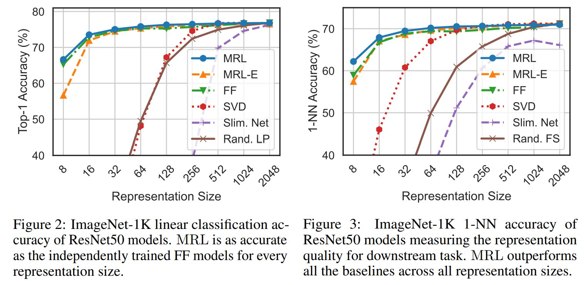

# [Matryoshka Representations for Adaptive Deployment](https://arxiv.org/abs/2205.13147)
_Aditya Kusupati*, Gantavya Bhatt*, Aniket Rege*, Matthew Wallingford, Aditya Sinha, Vivek Ramanujan, William Howard-Snyder, Kaifeng Chen, Sham Kakade, Prateek Jain, Ali Farhadi_

Learned representations are used in multiple downstream tasks like web-scale search & classification. However, they are flat & rigid -- Information is diffused across dimensions and cannot be adaptively deployed without large post-hoc overhead. We fix both of these issues with **Matryoshka Representation Learning** (MRL)🪆. 

<p align="center">

</p>

This repository contains code to train, evaluate, and analyze Matryoshka Representations with a ResNet50 backbone. The training pipeline utilizes efficient [FFCV](https://github.com/libffcv/ffcv-imagenet) dataloaders modified for MRL. The repository is organized as follows:

1. Set up
2. Matryoshka Linear Layer
3. Training ResNet50 Models
4. Inference
5. Model Analysis
5. Retrieval Performance


## Set Up
Pip install the requirements file in this directory:
```
pip install -r requirements.txt
```

### Preparing the Dataset
Following the ImageNet training pipeline of [FFCV](https://github.com/libffcv/ffcv-imagenet) for ResNet50, generate the dataset with the following command (`IMAGENET_DIR` should point to a PyTorch style [ImageNet dataset](https://github.com/MadryLab/pytorch-imagenet-dataset)):

```bash
# Required environmental variables for the script:
cd train/
export IMAGENET_DIR=/path/to/pytorch/format/imagenet/directory/
export WRITE_DIR=/your/path/here/

# Serialize images with:
# - 500px side length maximum
# - 50% JPEG encoded, 90% raw pixel values
# - quality=90 JPEGs
./write_imagenet.sh 500 0.50 90
```

## Matryoshka Linear Layer
We make only a minor modification to the ResNet50 architecture via the MRL linear layer, defined in `MRL.py`, which can be instantiated as:
```
nesting_list = [8, 16, 32, 64, 128, 256, 512, 1024, 2048]
fc_layer = MRL_Linear_Layer(nesting_list, num_classes=1000, efficient=efficient)
```
Where `nesting_list` is the list of representation sizes we wish to train on, `num_classes` is the number of output features, and the `efficient` flag is to train MRL-E.

## [Training ResNet50 models](train/)
<p align="center">

</p>

We use PyTorch Distributed Data Parallel shared over 2 A100 GPUs and FFCV dataloaders. FFCV utilizes 8 A100 GPUs, therefore we linearly downscale the learning rate by 4 to compensate. We utilize the `rn50_40_epochs.yaml` configuration file provided by FFCV to train MRL ResNet50 models for 40 epochs.
While training, we dump  model ckpts and training logs by default. `$WRITE_DIR` is same variable used to create the dataset. 

### Training Fixed Feature Baseline

```bash 
export CUDA_VISIBLE_DEVICES=0,1

python train_imagenet.py --config-file rn50_configs/rn50_40_epochs.yaml --model.fixed_feature=2048 \
--data.train_dataset=$WRITE_DIR/train_500_0.50_90.ffcv --data.val_dataset=$WRITE_DIR/val_500_uncompressed.ffcv \
--data.num_workers=12 --data.in_memory=1 --logging.folder=trainlogs --logging.log_level=1 \
--dist.world_size=2 --training.distributed=1 --lr.lr=0.425
```

### Training MRL model

```bash 
export CUDA_VISIBLE_DEVICES=0,1

python train_imagenet.py --config-file rn50_configs/rn50_40_epochs.yaml --model.mrl=1 \
--data.train_dataset=$WRITE_DIR/train_500_0.50_90.ffcv --data.val_dataset=$WRITE_DIR/val_500_uncompressed.ffcv \
--data.num_workers=12 --data.in_memory=1 --logging.folder=trainlogs --logging.log_level=1 \
--dist.world_size=2 --training.distributed=1 --lr.lr=0.425
```

### Training MRL-E model

```bash 
export CUDA_VISIBLE_DEVICES=0,1

python train_imagenet.py --config-file rn50_configs/rn50_40_epochs.yaml --model.efficient=1 \
--data.train_dataset=$WRITE_DIR/train_500_0.50_90.ffcv --data.val_dataset=$WRITE_DIR/val_500_uncompressed.ffcv \
--data.num_workers=12 --data.in_memory=1 --logging.folder=trainlogs --logging.log_level=1 \
--dist.world_size=2 --training.distributed=1 --lr.lr=0.425
```

By default, we start nesting from rep. size = 8 (i.e. $2^3$). We provide flexibility in starting nesting, for example from rep. size = 16, with the `nesting_start` flag as: 
```
# to start nesting from d=16
--model.nesting_start=4
```

## [Inference on Trained Models](inference/)

### Classification performance
To evaluate our models, run the following command (arguments in brackets are optional). To evaluate the Fixed Feature Baseline, pass `--rep_size <dim>` to evaluate particular representation size. This script is also able to evaluate the standard Imagenet-1K validation set (V1). To evaluate our uploaded checkpoints, please use `--old_ckpt`. Our model checkpoints can be found [here](https://drive.google.com/drive/folders/1IEfJk4xp-sPEKvKn6eKAUzvoRV8ho2vq?usp=sharing). `save_*` and `tta` (test time augmentation) flags will be useful for downstream [model analysis](model_analysis).

```python
cd inference

python pytorch_inference.py --path <final_weight.pt> --dataset <V2/A/Sketch/R/V1> \
[--tta] [--mrl] [--efficient] [--rep_size <dim>] [--old_ckpt] [--save_logits] \
[--save_softmax] [--save_gt] [--save_predictions]
```

In the paper we only consider $rep. size \in  [8, 16, 32, 64, 128, 256, 512, 1024, 2048]$. To evaluate on other rep. sizes, change the variable `NESTING_LIST` in `pytorch_eval.py`. 

#### Robustness Datasets

We also evaluate our trained models on four robustness datasets: ImageNetV2/A/R/Sketch. Note that for evaluation, we utilized PyTorch dataloaders. Please refer to their respective repositories for additional documentation and download the datasets in the root directory. 

1. [ImageNetV2_pytorch](https://github.com/modestyachts/ImageNetV2_pytorch)
2. [ImageNetA](https://github.com/hendrycks/natural-adv-examples)
3. [ImageNetR](https://github.com/hendrycks/imagenet-r)
4. [ImageNet-Sketch](https://github.com/HaohanWang/ImageNet-Sketch)


## [Model Analysis](model_analysis/)
`cd model_analysis` 

Here we provide four jupyter notebooks which contain performance visualization such as GradCAM images (for checkpoint models), superclass performance, model cascades and oracle upper bound. Please refer to detailed documentation [here](model_analysis/README.md).  

## [Retrieval Performance](retrieval/)
We carry out image retrieval on ImageNet-1K, ImageNetV2 and ImageNet-4K, which we created as an out-of-distribution dataset. A detailed description of the retrieval pipeline is provided [here](retrieval/README.md).
### ImageNet-4K
We created the ImageNet-4K dataset by selecting 4,202 classes, non-overlapping with ImageNet1K, from ImageNet-21K with 1,050 or more examples. The train set contains 1,000 examples and
the query/validation set contains 50 examples per class totalling to ∼4.2M and ∼200K respectively.
The list of images curated together to construct ImageNet-4K will be updated here shortly.

## Citation
If you find this project useful in your research, please consider citing:
```
@article{kusupati2022matryoshka,
  title={Matryoshka Representations for Adaptive Deployment},
  author={Kusupati, Aditya and Bhatt, Gantavya and Rege, Aniket and Wallingford, Matthew and Sinha, Aditya and Ramanujan, Vivek and Howard-Snyder, William and Chen, Kaifeng and Kakade, Sham and Jain, Prateek and others},
  journal={arXiv preprint arXiv:2205.13147},
  year={2022}
}
```
