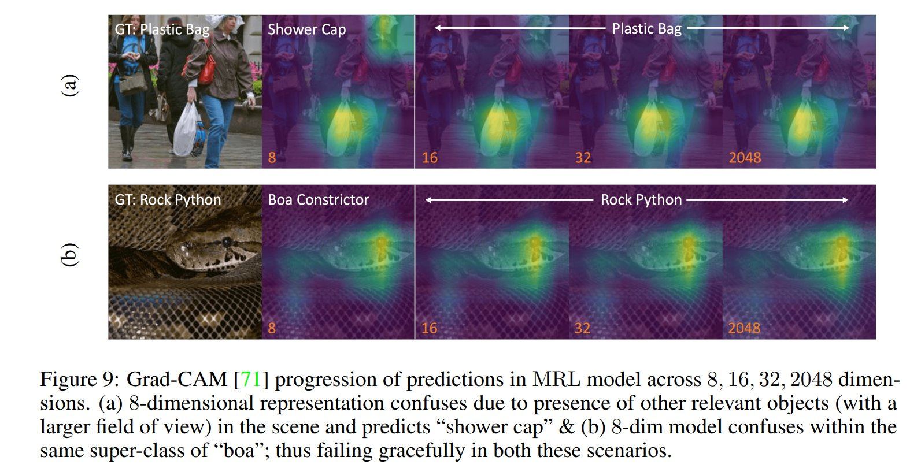
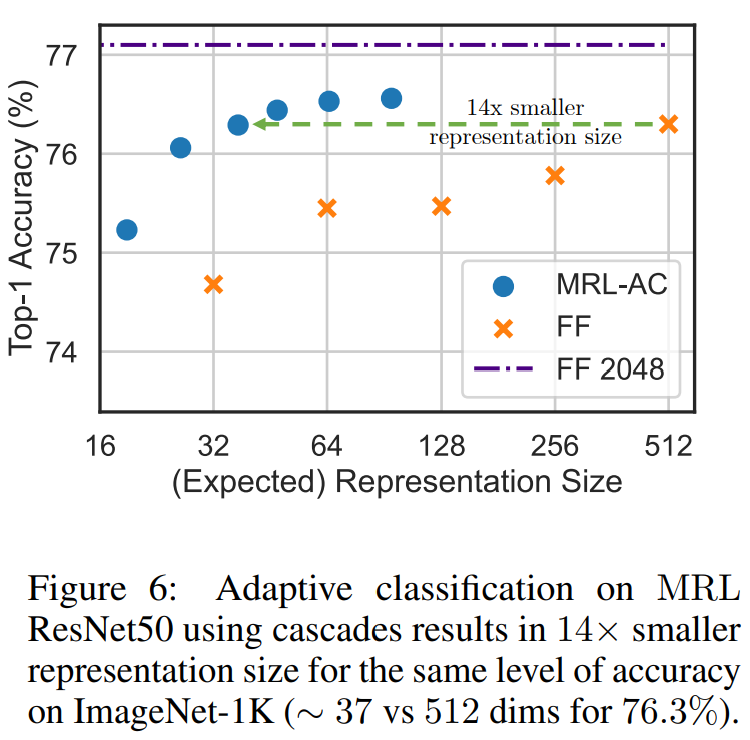

# Model Analysis
We provide Jupyter notebooks which contain performance visualization via [GradCAM](https://github.com/jacobgil/pytorch-grad-cam) images (for checkpoint models), superclass performance, model cascades and oracle upper bound. Please be sure to have predictions and softmax probabilities saved beforehand, using the appropriate `save-*` flags from `../inference/pytorch_inference.py`. Additionally, for adaptive classification using cascades, use the `--tta` flag in the above script. 

#### [GradCAM](GradCAM.ipynb)
This notebook visualizes model attribution for each image. As required preprocessing, we store each image as a torch tensor, arranged class-wise. This notebook illustrates that using smaller representation size for classification can result in model confusion between classes within the same superclass (*e.g.* Rock Python vs Boa Constrictor as in Figure 9.b below).

#### [Adaptive Classification with Cascades](<./Cascade_Performance_Paper.ipynb>)
This notebook evaluates our greedy scheme for model cascading, based on maximum probability thresholding. This notebook requires the softmax predictions for the model under consideration. 

#### [Custom SuperClass](<./Custom_SuperClass_Performance.ipynb>)
Based on [WordNet](https://www.nltk.org/howto/wordnet.html) hierarchy, we evaluate the MRL model on 30 randomly chosen superclasses. The code is based on the [MadryLab robustness package](https://github.com/MadryLab/robustness). 	  

#### [Oracle Upper Bound](<./Oracle_Upper_Bound_Performance.ipynb>)
While overall accuracy increases with a gradual increase in capacity, we observe that certain instances and classes are more accurate when evaluated with lower dimensions. Therefore, for each input image, there is an ideal rep. size which leads to the maximum possible achievable accuracy for MRL (or the oracle performance), which we compute in this notebook.

