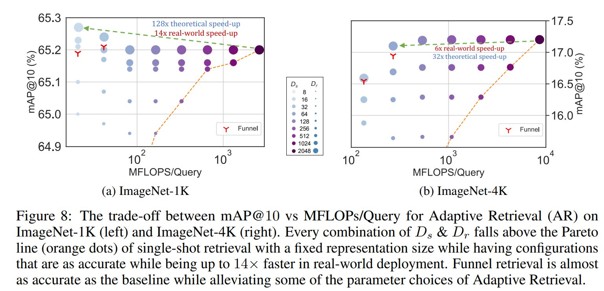
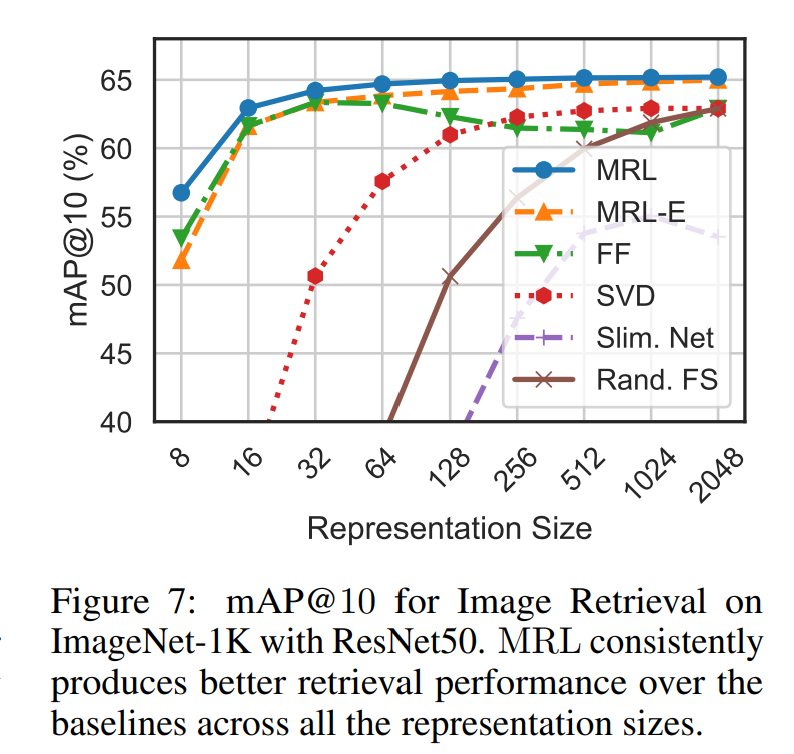

# Image Retrieval
The image retrieval pipeline consists of several distinct steps:

## ResNet50 inference to generate database and query set arrays
We utilize a native [PyTorch inference](../inference/pytorch_eval.py) to generate the database and query sets for image retrieval. An example for performing 
retrieval on [ImageNet-4K](../imagenet-4k/README.md) with an MRL pretrained model (trained with PyTorch DDP) is provided below:

```
python ../inference/pytorch_inference.py --retrieval --path=path_to_model/final_weights.pt \
--retrieval_array_path='output_path/' --dataset=1K --mrl
```
This will generate train (database) and val (query) arrays for the vector representations and labels for ImageNet-1K, ie
`1K_val_mrl1_e0_ff2048-X.npy`, `1K_val_mrl1_e0_ff2048-y.npy`, `1K_train_mrl1_e0_ff2048-X.npy`, and `1K_train_mrl1_e0_ff2048-y.npy`, which will be saved to disk in the `output_path/` directory.

## Database Index and Search
The arrays generated above are used to create an index file of the database, as shown in `faiss_nn.ipynb`. FAISS requires an 
index type (Exact L2, HNSW32) and a shortlist length $k$ to search the indexed database for each query in the query set. Note that we utilize GPU search 
for exact search, which is currently unsupported for HNSW. The $k$-length shortlist for all desired representation sizes is saved to disk to be used 
for downstream adaptive retrieval or metric computation as, for example, `neighbors/mrl/exactl2_16dim_2048shortlist_1K.csv`.

## Adaptive Retrieval
In an attempt to achieve equivalent performance to shortlisting at higher representation sizes with reduced MFLOPs, we perform adaptive retrieval by, for example, retrieving a shortlist $k = 200$ with rep. size $D_r = 16$ followed by reranking with a higher capacity representation $D_s = 2048$ on ImageNetv2 representations. The reranked k-NN shortlist is saved to disk as `8dim-reranked16_200shortlist_V2_exactl2.csv` as shown in `reranking.ipynb`.

In an attempt to remove supervision in choosing $D_r$ and $D_s$, we utilize **Funnel Retrieval.** Funnel retrieval thins out the initial shortlist by a 
repeated re-ranking and shortlisting with a series of increasing capacity representations. For example, retrieval with $D_r = 8$ followed by a funnel with Rerank Cascade *= [16, 32, 64, 128, 2048]* and Shortlist Cascade *= [200, 100, 50, 25, 10]* would be saved as  
`8dim-cascade[16,32,64,128,2048]_shortlist[200,100,50,25,10]_1K_exactl2.csv`

<p align="center">

</p>

## Metric Computation
We compute mAP@k, precision@k, recall@k, and top-k accuracy of the k-NN shortlist for various values of $k$, as shown in
`compute_metrics.ipynb`, with flags for model configuration, dataset, index type, and retrieval configuration required. The script loads database labels
`1K_train_mrl1_e0_ff2048-y.npy` and query labels `1K_val_mrl1_e0_ff2048-y.npy` alongside the k-NN shortlist generated via FAISS retrieval 
(`neighbors/mrl/exactl2_16dim_2048shortlist_1K.csv` as in the example above) or 
after reranking/funnel retrieval in the steps above.

<p align="center">

</p>
